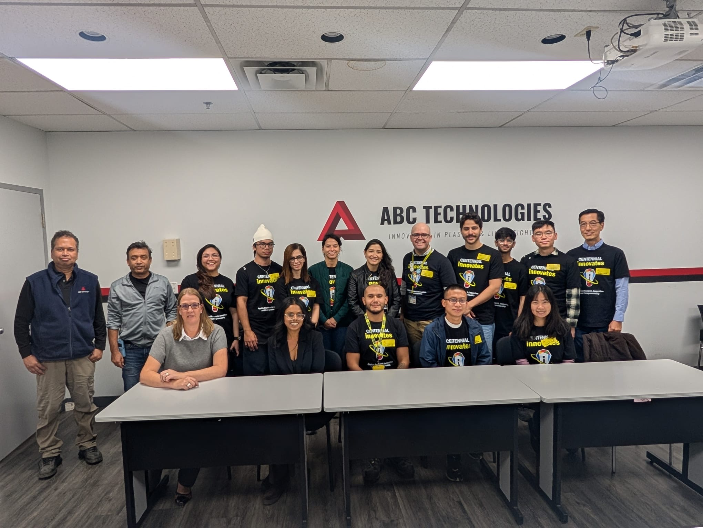
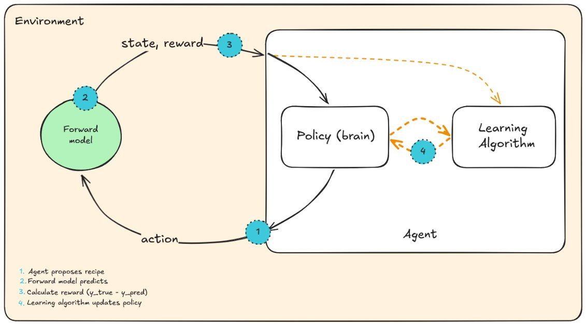
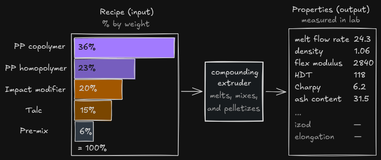
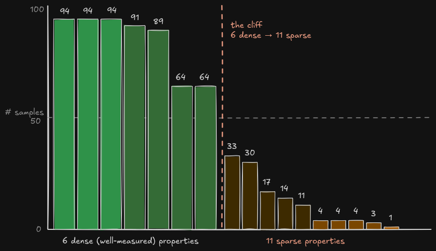
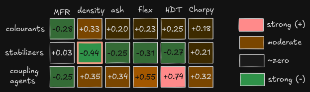
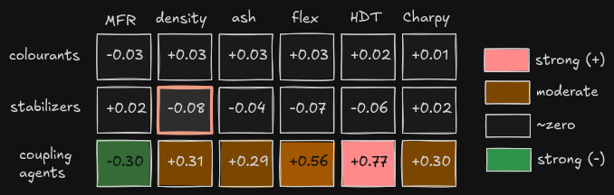
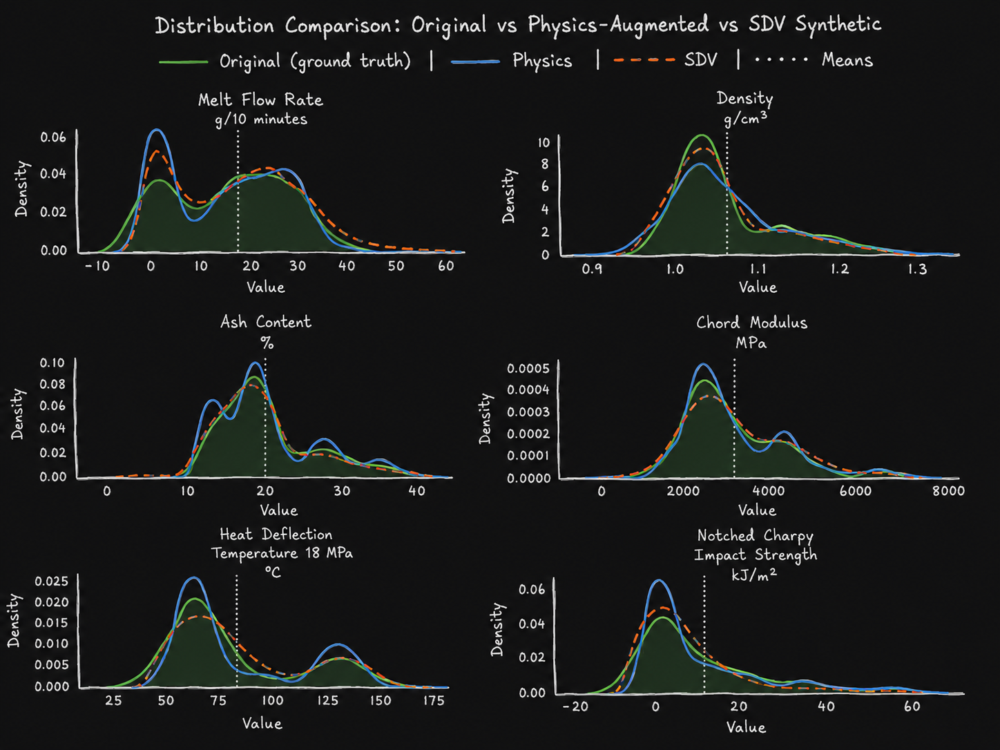
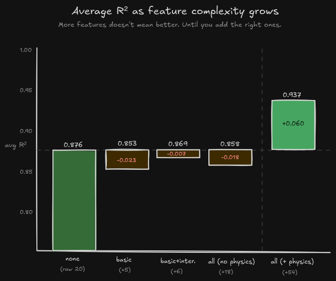
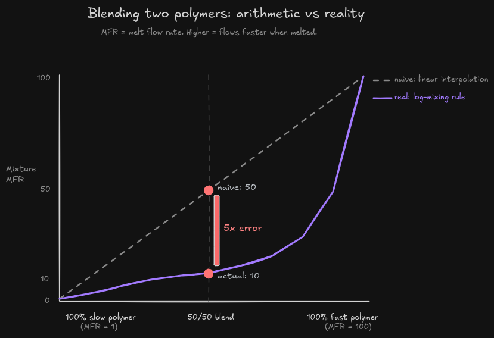
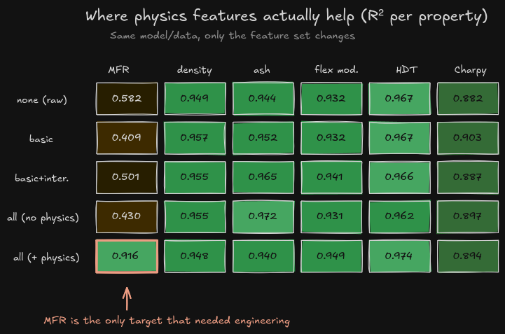

## The Journey

While in the fifth semester of the Software Eng Tech - AI diploma at Centennial College, my professor announced that they were looking for a student to participate in a polymer manufacturing project. She invited a couple of students to apply, and to my surprise, I was one of them.

The interview problem was framed as a cake. Imagine a document describing the scientific properties the cake must have: glucose level, density, thickness, colour, etc. Could I build a model that predicts a recipe matching those targets?

I said I thought I could. They asked, "How?"

The semester before, I studied supervised learning and neural networks, mostly tree-based models, classifiers, ensemble methods, and basic perceptron theory. I asked about the data and was told there were fewer than 500 samples, each with a recipe, meaning material percentages adding up to 100%, and the resulting properties.

I started eliminating options in my head. A neural network would probably not converge on such a small dataset. The output was continuous, so binary classifiers were out. The only feasible thing I could think of was a Random Forest, using branching logic to approximate how materials affected properties.

Two days later, I found out the professor liked how optimistic, and naive, I was about my ability to do this. I was hired.

When I joined, the project was already in its second phase. Phase 1 had just been delivered, funnily enough using a Random Forest model, and lab technicians at the polymer research lab were already using it.

Several subject matter experts supported the project. I met them during a plant visit, which made it very clear that I was working with a large international company and very smart people. The goal of phase 2 was simple: improve what had already been delivered.

## The Problem

The project was trying to answer this question:

> I want a plastic with x stiffness, melt rate, colour, and elongation. What material blend would make it?

In material informatics, this is called the inverse problem. The forward problem is easier to reason about: given a recipe, predict the resulting properties. The inverse problem is harder because there is not just one answer. Many recipes can yield similar properties.

The existing system trained product-specific models. In the repo, this showed up literally: folders for different customer specs, material blends for each one, and a backend loading separate Random Forests. The team had also tried neural networks, active learning, CNNs, and synthetic data, but Random Forest performed best, so they deployed it.

Given the data, this was reasonable. Some products had fewer than twenty trials. One had around forty. At that size, building the best approximator you can and wrapping it in something people can use is already useful.

But it had clear limits:

- A model had to be trained for every new product
- Tree-based models mostly interpolate what they have already seen
- The model could not handle the non-linearity of the blending process
- The model could not handle the dimensionality of the data if all trials were merged
- The model could not learn from SME feedback

If we could improve those areas, we could save lab time and reduce the testing budget. Money not spent is earnings, no? Maybe?

## The Research Bet

My professor, now my lead, gave me a week to look into ways we could improve the model, the data, and the implementation. I spent that week reading papers, articles, and talking with LLMs. I explored extreme trees, cube regression, neural network architectures, and eventually reinforcement learning.

During one of my Reinforcement Learning classes, the professor was doing a deep dive on environments. I had already built a couple of simple OpenAI gym environments and trained a DQN, so I started wondering: how hard could it be to turn this into an RL problem?

Pretty hard, it turns out. A real environment would mean simulating extruders, testing machines, ovens, and the physics of the lab. I am awful at physics. We had four months. That idea died quickly.

Then I found a presentation by Jessica Hamrick, a research scientist at DeepMind, about model-based reinforcement learning. The idea was simple enough to click immediately: instead of using the real environment, train a model of the environment and use that model to train the agent.

That was the missing piece. We already had real production recipes and measured properties. What if I trained a forward model, recipe -> properties, and used that model as a personal physics simulator? The RL agent could generate recipes, send them through the forward model, get predicted properties back, calculate a reward, and keep searching.



At the pitch meeting, I started with the smaller question: "If our task was the opposite, to build a model that predicts recipe -> properties, could we build a highly accurate model?"

My professor said yes. We had past experience, data, and supervised learning was a mature field.

Then I asked, "What if we present the inverse problem as an RL problem and use the forward model as the environment?"

That got me the green light. The other student was already improving the supervised approach, so I was allowed to treat this as a long shot. If it worked, who knows, it could be a game-changer. I think the professor hired me for this reason: I am an unconscious dreamer, I believe anything is possible, even if it ends up biting me in the ass.

## First Contact with the Data

While in the clouds with the new possibility, I had not stopped to think about the constraints. This came crashing down when I reviewed the dataset: about 200 samples, more than 50 materials, and 20 mechanical, thermal, and electrical properties, most of which were missing.

I requested all available data and salvaged another ~300 samples, bringing the total to about 500. After analyzing feature availability, I chose six properties available in at least 70% of the trials. I thought missing data would not be a big problem because, like in class, we could always impute the empty gaps. That was shut down quickly. You cannot impute the realities or conditions of lab testing.



_Figure: A blend as ingredient percentages, pushed through the manufacturing process, with lab-measured properties on the other side._



_Figure: the held-out test set had 94 rows, but most properties were not measured on all 94. The six targets I used in the controlled feature comparison had 64-94 measurements._

When I brought up the inconsistency, the SMEs said, "This is the real world." Not all OEM specs require all target properties, so the lab only tests what the customer requests.

Before any model conversation made sense, I had to understand what a recipe even meant. Every blend had categories of materials that came together to make the product. Like a cake, you need baking powder, and in polymer blends that maps closer to a stabilizer: a small ingredient that helps the product survive processing.

| Recipe role | Material categories | How I understood them |
|---|---|---|
| Passive (shouldn't affect properties) | Colourants, stabilizers | Ingredients that help with colour, stability, or surface behaviour. |
| Active organic materials (affect properties) | Homopolymers, copolymers, impact modifiers | The main polymer families. The most important ingredients, drives the product behaviour. |
| Active inorganic materials (affect properties) | Talc, glass fibre, glass spheres | Mineral that can change stiffness, density, and has a linear relation with ash content. |
| Active edge cases | Coupling agents and masterbatches | Pre-blended situational materials. |

The first dataset I received was only phase 2 trials. That made sense from the project perspective because phase 1 had trained a model per product, each with its own subset of trials. But if I wanted one model to learn across products, I needed every recipe I could get.

So I asked for phase 1 trials and got the dataset to ~350 samples. Later, while grilling the SMEs for anything else, they told me there were production samples too. These were not trials in the experimental sense, but production blends that were tested. After merging those, we got to ~500 samples.

Even after all that, the dataset was tiny, wide, incomplete, and noisy. The SMEs also explained that plant conditions created baseline variance: if you put the exact same recipe in the exact same machine at the exact same time, the output is still not deterministic. It can vary +-5%.

Between the missing properties, the tiny sample count, and the baseline variance, I was not feeling too optimistic.

## The Surprise

The dataset was lying to me.

With the largest dataset I could realistically get, I started asking basic questions. Which materials move which properties? I ran the usual correlation calculations, like Spearman and Pearson, and found that all materials had some sort of correlation with properties they supposedly did not affect.

The most explicit example was colourant having a correlation with all six main properties.



_Figure: Weird correlation between stabilizers and density (`r = -0.44`). Stabilizers protect against oxidation and UV, but don't influence density. Density is determined by the base polymer._

This led me down a rabbit hole that made me understand that correlation was not measuring causality. It was measuring how much x moved with y. In this dataset, some variables moved together because of mutual exclusivity, not because one caused the other.

Colourant is a good example. It was mostly used in exterior products. Exterior parts need high-impact properties because they are the first to be hit in a collision. So colourant kept showing up alongside high-impact recipes, which made the data claim colourant contributed to stiffness and impact strength. It did not.

The same thing happened with stabilizers. Stabilizer selection depends on polymer types. Polymer families affect density. So the pattern between stabilizer and density came from stabilizers being linked to polymer families, not from stabilizers changing density.

## The Fix

The main insight that worked was to avoid generating new property values. Instead, I duplicated recipes and altered passive materials such as colourants and stabilizers. The properties stayed the same, while the artificial correlations got weaker.

I called this method **null augmentation**.

Each original row was duplicated ~10x, yielding 4,136 training samples. After applying this method, the correlation between stabilizer loading and density dropped from `r = -0.44` to `r = -0.08`. The colourant correlations mostly disappeared too.



_Figure: after randomizing the passive ingredients, colourants and stabilizers mostly stop correlating with the target properties. Coupling agents are the warning row: they look passive because they are small, but they still carry real signal._

The important lesson was that passive depends on physics, not just ingredient size. Colourants are passive because they do not affect the target properties. Coupling agents look passive because they are small, but they can have a large effect. The augmentation method had to respect that difference.

On the forward model, null augmentation lifted R2 on the main property from 0.84 to 0.93, the single biggest gain on any property. On the other core properties, the model was already in the 0.93-0.97 range without augmentation, so the gains were small, within +-0.01.

I found out later that this idea has a name. The paper Nuisances via Negativa frames it as varying non-causal features to force the model to learn causal ones. A cleaner formulation than I had.

The takeaway: before synthesizing, know what your data is correlated with. Small datasets lack signal and often contain patterns that look like real physics but are actually artifacts of data collection. Making more synthetic rows can amplify the wrong thing.

## The Detour

Before null augmentation clicked, I tried the obvious path: generate more data.

The other student had already built a synthetic data pipeline in phase 1 using Synthetic Data Vault, so I explored it further. I tried GaussianCopula, TVAE, and CTGAN.

All three failed in some way. They struggled to keep the constraint that material blends must sum to 100%. The neural network approaches could not converge well with the missing data. GaussianCopula was the most usable, not because it was great, but because it failed less.

We also wanted to try the Bootstrap synthesizer from DataCebo because it was designed for short-and-wide data, which was exactly our case. It was behind a paywall, and after trying to purchase it multiple times, we could not get access.

In the end, I did not use synthetic data. Even with custom constraints like "recipes must sum to 100%" and "colourant must stay within its allowed range", the generated distribution was not faithful enough.



_Figure: the SDV rows looked close enough to be tempting, but they still drifted away from the real distributions in places where I needed the data to be faithful. The physics-shaped copies were not magic, but they stayed closer to the original target distributions._

## The Clustering Moment

The original dataset had 50+ distinct ingredients and only ~500 trials. I needed to reduce dimensionality without losing the information that mattered.

The first grouping pass was easy: passive ingredients. All colourants became one `colourant` feature. Same for stabilizers, process aids, and coupling agents.

The second pass was active inorganic materials, or fillers. Talc variants became `talc`, and glass fibre variants became `glass fibre`. Those groups map roughly to ash content, which made them easier to justify.

The hardest pass was active organic materials: the polypropylene families, copolymers, homopolymers, and impact modifiers. I tried k-means, hierarchical clustering, and DBSCAN using material technical sheets sourced from UL. The clusters looked successful numerically, but they ignored chemistry. Some groups mixed homopolymers with copolymers because the same properties were not available for every polymer, and the sheets varied by country, unit, and test setup.

The SMEs gave us the better rule: use melt flow rate as the key property, then group by polymer type. That respected the chemistry much better than my clustering experiments did.

By this point we had around 20 features: high-MFR homopolymer, low-MFR copolymer, talc, colourant, and situational features like talc master batch, a pre-blend of 70% talc and 30% unknown polymer.

## Feature Engineering and the SME's Spreadsheet

At this point, the dataset was usable, but the model still did not know polymer chemistry. The forward model was around ~60% average R2. Some properties, like ash content, were in the high 80s. Others, like melt flow rate, were in the low 40s.

The next step was to add domain knowledge directly to the dataset. The first feature was total inorganic material. I summed the talc and the talc contribution from the 70% and 80% master batches. This taught the model that masterbatches were ash-content contributors, even if the raw columns hid that relationship.

The rest followed the same pattern: take the SME's spreadsheet or mental model and encode it as features the model could actually see. This was not an iterative "add one clever feature, retrain, celebrate" story. The bottleneck was getting the right domain knowledge into the table at all.



_Figure: the average score does not improve just because the feature set gets bigger. The jump only appears when the physics features enter._

## The Melt Flow Rate Exception

Most polymer properties were smooth enough for a neural network to learn. If you add a little more talc, stiffness moves a little, and ash content moves linearly. If you change the base polymer, density moves in a way that is not perfectly linear, but still learnable. Small recipe changes usually make small property changes, and neural networks are good at learning that kind of shape.

Melt flow rate was the exception.

Melt flow rate is how easily melted plastic flows. Higher means it flows faster. A manufacturer cares about it for almost every plastic part because it tells you how the material behaves when it is being processed.

The weird part is that melt flow rate does not behave like a normal average. If I blend two polymers 50/50, and one has melt flow rate of 1 while the other has melt flow rate of 100, the naive answer is:

```text
(1 + 100) / 2 = 50.5
```

But the real answer is closer to 10.

The way the SME explained it, you do not average the melt flow rates directly. You take the log of each one, average those logs by recipe percentage, then turn it back into a normal number.

```text
log10(1)   = 0
log10(100) = 2

50/50 blend:
(0.5 * 0) + (0.5 * 2) = 1

10^1 = 10
```

So the arithmetic answer says 50. The physical answer says 10. That is a 5x difference from one of the simplest possible blends.

A neural network could probably learn that if I had tens of thousands of recipes covering every kind of blend. I did not. I had about 500 real trials, then about 4,100 variants built from those same trials. That was not enough for the model to discover this rule by itself, especially when the important range was compressed and the examples were unevenly distributed.

This is where the SME's spreadsheet mattered. It did not replace the model. It gave the model a number it could not have computed on its own from this much data.



_Figure: a 50/50 blend of a slow polymer and a fast polymer does not land halfway between them. That was the kind of rule the network needed help with._

And the result was almost too clean. Across the other properties, adding the physics features barely changed the score. Density, ash content, stiffness, HDT, Charpy, all of those were already in good shape. Melt flow rate was the one that moved.

Without the physics features, melt flow rate was stuck around R2 = 0.43. With the SME's melt flow features included, it jumped to R2 = 0.92.

That told me something important. The model architecture was not the main character here. The data work was. The model already knew how to learn smooth relationships. What it needed was help with the one rule that looked simple to a polymer expert and invisible to a small neural network.



_Figure: across the other five targets, the scores barely move. Melt flow rate is the one target that changes shape when the physics features are added._

## Closing: Where This Leaves Us

This started as a model architecture problem in my head. Could reinforcement learning solve the inverse problem? Could a model-based setup search recipe space better than a Random Forest?

Maybe. But the first real gains came from somewhere less glamorous: making the data honest enough for a model to learn from.

Null augmentation weakened fake correlations. SME-driven grouping reduced dimensionality without throwing away chemistry. Physics features gave the model rules it could not infer from 500 rows. Melt flow rate was the clearest example: R2 moved from 0.43 to 0.92 when those features went in.

That is where part 1 leaves the project: before the final model comparison, before the RL experiments, and before finding out how much architecture mattered after the data work was done.
